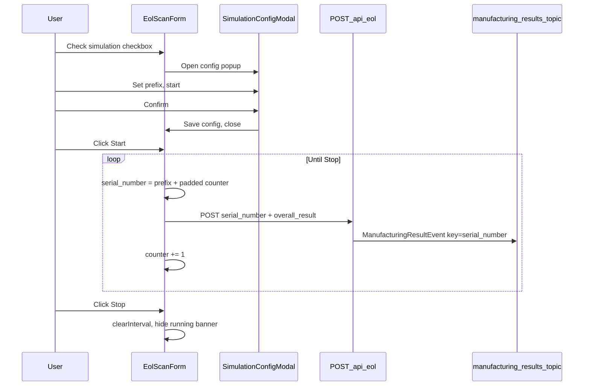
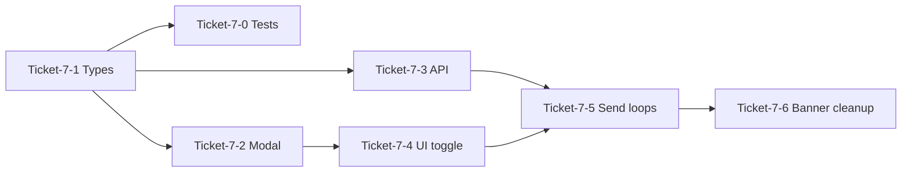

# Manufacturing Simulation Mode — GitHub Story & Tickets

## Context (current mes-ui)

mes-ui is a single-page Next.js app ([`app/page.tsx`](../../app/page.tsx)) with manual EOL scan ([`app/components/EolScanForm.tsx`](../../app/components/EolScanForm.tsx)). Kafka is sent **server-side** via [`POST /api/eol`](../../app/api/eol/route.ts) → [`sendEolToKafka()`](../../lib/kafka.ts).

**Message format (required):** Current mes-ui sends legacy `manufacturing_simple` (`barcode`, `productSeq`, …). The correct format is **`ManufacturingResultEvent`** per [`kafka-manufacturing-result-message-example.md`](../../../mes-api/docs/kafka/kafka-manufacturing-result-message-example.md): snake_case JSON on topic **`manufacturing-results-topic`**, with **`serial_number` as both Kafka message key and payload field**. Simulation increments `serial_number` each tick (`{prefix}{paddedNumber}`). Other fields use sensible simulation defaults (aligned with mes-api example / `mes-db` test data).

There are **no** checkboxes, modals, or start/stop controls today. Manufacturing fields are **hardcoded** in the API route.



## User flow (target)

1. User checks **Enable Manufacturing Simulation** checkbox.
2. Config popup opens immediately (native `<dialog>` or overlay — no UI library in repo today).
3. User configures:
   - **Serial prefix** (e.g. `SN-20250215-`)
   - **Starting number** (e.g. `1`, displayed as zero-padded suffix `001`)
   - **Send interval** (seconds, for auto mode)
   - **Send mode**: automatic interval **or** manual single-send per action
4. User clicks **Confirm** → popup closes; main UI shows simulation controls (Start / Stop).
5. User clicks **Start** → UI shows banner **"Manufacturing Simulation Running"** and begins sending Kafka messages.
6. Each message sets `serial_number = prefix + paddedNumber`; counter increments by 1 on every send. Kafka key and payload `serial_number` match.
7. User clicks **Stop** → interval cleared, no more messages, banner hidden.
8. Unchecking simulation checkbox (while stopped) returns to manual scan mode.

---

## Copy-paste GitHub story

```markdown
## [Story-7] Manufacturing Simulation Mode

**Epic / repo:** mes-ui  
**Goal:** Allow operators to simulate a manufacturing line by automatically (or manually) sending incrementing EOL Kafka messages without scanning barcodes.

### User story
As an operator testing the MES pipeline, I want to enable simulation mode, configure a serial number prefix and starting value, then start/stop automatic Kafka message production so I can validate downstream consumers without physical scans.

### Acceptance criteria
- [ ] Checking "Enable Manufacturing Simulation" opens a config popup before simulation controls appear.
- [ ] Popup fields: serial prefix, starting number, send interval (seconds), send mode (auto interval | manual single-send).
- [ ] Confirm closes popup and reveals Start / Stop on the main UI; manual barcode submit is disabled while simulation is enabled.
- [ ] Start shows **"Manufacturing Simulation Running"** banner and begins sending messages.
- [ ] Each sent message increments `serial_number`: `{prefix}{paddedNumber}` (e.g. `SN-TEST-20260519-0001` → `…-0002`). Kafka **key** and payload `serial_number` match.
- [ ] Stop halts all pending sends and hides the running banner.
- [ ] Auto mode sends on the configured interval until Stop.
- [ ] Manual mode sends exactly one message per user trigger (Start or dedicated Send — implementer choice, document in UI).
- [ ] Failed sends surface error state via existing [`StatusLight`](app/components/StatusLight.tsx) and status message; simulation does not silently continue on hard failures (configurable: stop on error vs continue).
- [ ] Interval timer and in-flight requests are cleaned up on Stop and component unmount.
- [ ] All Kafka sends use topic **`manufacturing-results-topic`** with **`ManufacturingResultEvent`** payload (not legacy `manufacturing_simple` / `eol-raw-data`).

### Out of scope (this story)
- Configuring every `ManufacturingResultEvent` field in the popup (`mo_id`, `controller_id`, `fixture_id`, `test_data_json`, etc.) — use simulation defaults; only `serial_number` is user-configured and self-incremental.
- Persisting simulation config across browser sessions.

### Technical notes
- **Migrate Kafka payload** in [`lib/kafka.ts`](lib/kafka.ts) from `manufacturing_simple` to snake_case `ManufacturingResultEvent` aligned with [`ManufacturingResultEvent`](../../mes-api/src/main/java/com/mytech/mesapi/kafka/dto/ManufacturingResultEvent.java) and [`kafka-manufacturing-result-message-example.md`](../../mes-api/docs/kafka/kafka-manufacturing-result-message-example.md).
- **Topic:** default `manufacturing-results-topic`; update [`env.example`](env.example), API route, and UI copy.
- **Key:** set Kafka message key to `serial_number` (partition ordering per mes-api docs).
- **Request body:** accept `serial_number` (manual scan input maps to this field; deprecate/rename `barcode` in types).
- **Simulation defaults** for non-serial fields (example): `product_type: "SCU"`, `mo_id: 1`, `station_id: null`, `controller_id: 10`, `fixture_id: 11`, `nest_number: 1`, `overall_result: "PASS"|"FAIL"`, `operator_id: "OP-TEST"`, `shift_code: "A"`, `created_at` = now. Use IDs from `mes-db/baseline/03_test_data.sql` where applicable.
- Client owns serial counter (`useRef`); server remains stateless per request.

### Tickets
- [Ticket-7-0] Add Vitest and simulation unit tests
- [Ticket-7-1] Add simulation types and serial_number formatting utilities
- [Ticket-7-2] Build SimulationConfigModal component
- [Ticket-7-3] Migrate Kafka payload to ManufacturingResultEvent and fix topic
- [Ticket-7-4] Add simulation mode toggle and main UI controls to EolScanForm
- [Ticket-7-5] Implement auto-interval and manual single-send loops with incrementing serial_number
- [Ticket-7-6] Add running banner, status feedback, and cleanup on stop/unmount
```

---

## Tickets (detailed, copy-paste ready)

### [Ticket-7-0] Add Vitest and simulation unit tests

**Description:** Introduce a unit-test runner for mes-ui and cover simulation helpers from Ticket-7-1. Simulation mode is **long-lived** operational tooling; automated tests prevent regressions in serial formatting and config validation as Story-7 tickets land.

**Depends on:** [Ticket-7-1] (`app/types/simulation.ts`, `lib/simulation.ts` must exist).

**Tasks:**
- Add **Vitest** as dev dependency (`pnpm add -D vitest`).
- Add [`vitest.config.ts`](../../vitest.config.ts): resolve `@/*` path alias (match [`tsconfig.json`](../../tsconfig.json)); include `**/*.{test,spec}.ts`.
- Add npm scripts in [`package.json`](../../package.json): `"test": "vitest run"`, `"test:watch": "vitest"`.
- Add [`lib/simulation.test.ts`](../../lib/simulation.test.ts) — unit tests for `formatSerialNumber` and `validateSimulationConfig` (cases below).
- Add [`docs/plans/testing-strategy.md`](testing-strategy.md) — copy of **Testing strategy (tech note)** section from this doc (single source for what to test in Story-7 and later).
- Do **not** add React Testing Library / jsdom in this ticket (pure `lib/` tests only; component testing is optional later).

**Minimum test cases (`lib/simulation.test.ts`):**
- `formatSerialNumber("SN-TEST-20260519-", 1)` → `SN-TEST-20260519-0001`
- Counter increment: `1` → `…-0001`, `2` → `…-0002` (default pad width 4)
- Custom `padWidth` when passed explicitly
- Valid config (auto and manual) → `validateSimulationConfig` returns `null`
- Empty / whitespace `serialPrefix` → error
- `startNumber` &lt; 0 or non-integer → error
- Auto mode: `intervalSeconds` &lt; 1 or non-integer → error
- Manual mode: `intervalSeconds` not validated (no error when interval is low)

**Acceptance:**
- `pnpm test` passes locally with zero failures.
- No React or Kafka dependencies in the test suite for this ticket.
- Follow **Testing strategy (tech note)** when adding tests in later tickets (7-3 API route tests are recommended there, not required in 7-0).

---

### [Ticket-7-1] Add simulation types and serial_number formatting utilities

**Description:** Define TypeScript types and pure helpers for simulation config and self-incremental `serial_number` generation. Keep simulation code isolated so it can be deleted with minimal effort when real line functionality ships.

**Tasks:**
- Add [`app/types/simulation.ts`](../../app/types/simulation.ts) (simulation-only — delete with feature):
  - `SimulationConfig`: `{ serialPrefix, startNumber, intervalSeconds, sendMode: 'auto' | 'manual' }`
  - `SimulationSendMode`
  - Constraint constants (min interval ≥ 1s, startNumber ≥ 0, default pad width 4)
- Add [`lib/simulation.ts`](../../lib/simulation.ts) (simulation-only — delete with feature):
  - `formatSerialNumber(prefix, number, padWidth = 4)` → e.g. `SN-TEST-20260519-0001` (align pad width with mes-api examples)
  - `validateSimulationConfig(config)` with user-facing error strings
- Do **not** add simulation types to [`app/types/eol.ts`](../../app/types/eol.ts) — that file stays the permanent `POST /api/eol` contract (`EolSubmitBody`, `EolSubmitResponse`, `toOverallResult`).
- `ManufacturingResultPayload` already lives in [`lib/kafka.ts`](../../lib/kafka.ts) (Ticket-7-3); no duplicate type in this ticket.

**Acceptance:**
- Unit-testable pure functions; no React dependencies.
- Only `SimulationConfigModal` and simulation branches in `EolScanForm` import from `simulation.ts` / `lib/simulation.ts`.
- Output matches `serial_number` format in [`kafka-manufacturing-result-message-example.md`](../../../mes-api/docs/kafka/kafka-manufacturing-result-message-example.md).

---

### [Ticket-7-2] Build SimulationConfigModal component

**Description:** Config popup opened when user enables simulation checkbox.

**Tasks:**
- Create [`app/components/SimulationConfigModal.tsx`](../../app/components/SimulationConfigModal.tsx) using native `<dialog>` + Tailwind (match [`EolScanForm`](../../app/components/EolScanForm.tsx) styling).
- Fields: Serial prefix (text), Starting number (number), Interval seconds (number, shown when auto mode), Send mode (radio: Auto / Manual).
- Buttons: **Confirm** (validate + `onConfirm(config)`), **Cancel** (close + uncheck simulation parent state).
- Accessibility: focus trap, `aria-modal`, labelled inputs, Escape to cancel.

**Acceptance:**
- Invalid config blocks Confirm with inline errors.
- Confirm passes validated `SimulationConfig` to parent and closes dialog.

---

### [Ticket-7-3] Migrate Kafka payload to ManufacturingResultEvent and fix topic

**Description:** Replace legacy `manufacturing_simple` payload with mes-api-aligned `ManufacturingResultEvent` JSON; fix topic to `manufacturing-results-topic`; support client-provided `serial_number` for simulation increment.

**Tasks:**
- **Replace payload** in [`lib/kafka.ts`](../../lib/kafka.ts):
  - Remove `EolMessagePayload` / `manufacturing_simple`
  - Add `ManufacturingResultPayload` (snake_case fields per [`ManufacturingResultEvent`](../../../mes-api/src/main/java/com/mytech/mesapi/kafka/dto/ManufacturingResultEvent.java))
  - `sendManufacturingResultToKafka(payload)`: key = `serial_number`, value = JSON payload
- **Topic fix:** default `manufacturing-results-topic`; rename env var to `KAFKA_TOPIC_MANUFACTURING_RESULTS` (optional legacy fallback for `KAFKA_TOPIC_EOL_RAW_DATA`)
- Update [`env.example`](../../env.example), route comments, success/error messages, [`EolScanForm.tsx`](../../app/components/EolScanForm.tsx) UI copy
- Update [`EolSubmitBody`](../../app/types/eol.ts): `serial_number: string` (rename from `barcode`; keep backward-compat alias optional), `manufacturingResult?: "pass" | "fail"` → maps to `overall_result: "PASS" | "FAIL"`
- Update [`app/api/eol/route.ts`](../../app/api/eol/route.ts):
  - Build full `ManufacturingResultPayload` with simulation defaults for non-serial fields (see mes-api example: `product_type`, `mo_id`, `controller_id`, `fixture_id`, `nest_number`, `cycle_time_seconds`, `operator_id`, `shift_code`, `created_at`, nullable `station_id`, `test_data_json`, etc.)
  - Use request `serial_number` in payload; omit `id` (DB auto-increment)
- Remove hardcoded `productSeq`, `barcode`, `productCode`, `stationCode` from legacy format

**Acceptance:**
- Produces to **`manufacturing-results-topic`** with key = value `serial_number`.
- Payload deserializable by mes-api `ManufacturingResultEvent` consumer.
- Manual scan: user-entered value becomes `serial_number` in Kafka message.
- Simulation: API accepts incrementing `serial_number` from client each tick.
- *(Recommended, per [testing-strategy.md](testing-strategy.md)):* route tests for payload shape and `serial_number` mapping — can be same PR or follow-up.

---

### [Ticket-7-4] Add simulation mode toggle and main UI controls to EolScanForm

**Description:** Wire checkbox, modal, and Start/Stop into the main page.

**Tasks:**
- Add checkbox: **Enable Manufacturing Simulation**.
- On check → open `SimulationConfigModal`; on confirm → store config in state, show simulation panel.
- On uncheck (only when not running) → clear config, restore manual barcode form.
- While simulation enabled: disable manual barcode input / Submit.
- Show **Start** and **Stop** buttons (Stop disabled until running).

**Acceptance:**
- Mode switching is clear; cannot uncheck or edit config while simulation is running.
- Layout remains usable on mobile (existing `max-w-2xl` pattern).

---

### [Ticket-7-5] Implement auto-interval and manual single-send loops with incrementing serial_number

**Description:** Core send logic; each tick builds and sends the next `serial_number`.

**Tasks:**
- `useRef` for current serial counter (initialized from `config.startNumber` on Start).
- Shared `sendSimulationTick()`:
  - Build `serial_number` via `formatSerialNumber(prefix, currentCounter)`
  - `POST /api/eol` with `{ serial_number, manufacturingResult }`
  - On success: increment counter
- **Auto mode:** `setInterval` at `intervalSeconds`; first tick on Start or after first interval (document choice).
- **Manual mode:** one tick per Start click (or add **Send next** button when running in manual — keep UX simple).
- Stop: `clearInterval`, ignore late responses with aborted flag.

**Acceptance:**
- `serial_number` increments correctly across messages (`…-0001`, `…-0002`, …).
- Each Kafka message key matches payload `serial_number`.
- Stop prevents further ticks; no duplicate intervals on double-Start.

---

### [Ticket-7-6] Add running banner, status feedback, and cleanup on stop/unmount

**Description:** Operator-visible running state and safe teardown.

**Tasks:**
- Prominent banner when running: **"Manufacturing Simulation Running"** (e.g. amber bar below title).
- Show live info: last `serial_number` sent, message count (optional).
- Reuse [`StatusLight`](../../app/components/StatusLight.tsx): idle while running, pass/error per tick.
- `useEffect` cleanup on unmount: clear interval, optionally `AbortController` for in-flight fetch.
- Error policy: on send failure, set error status; stop auto loop (recommended default).

**Acceptance:**
- Banner visible only while simulation is actively running (not merely configured).
- No orphaned timers after navigation/unmount in dev HMR.

---

## Testing strategy (tech note)

Use when implementing Ticket-7-0 and later Story-7 tickets. Canonical copy: [`docs/plans/testing-strategy.md`](testing-strategy.md) (created in Ticket-7-0).

### Industry best practice (practical)

| Situation | Typical practice |
|-----------|------------------|
| Pure formatting / validation with clear rules | **Unit tests** — high value, low cost |
| Long-lived feature code (e.g. simulation helpers) | **Unit tests** — regressions are worth catching |
| API / Kafka payload contract (`POST /api/eol`, `ManufacturingResultPayload`) | **Integration or route tests** — higher value than UI-only tests |
| React modal / form wiring (checkbox, Start/Stop) | **Light testing** — manual QA or a few component tests if infra exists |
| Logic shared by client and server | **Test once** in the shared module (`lib/simulation.ts`, route handler) |
| Logic only in UI with obvious inline validation | **Lower priority** than shared helpers and API |

### What to test in Story-7

| Layer | File(s) | Priority | Test type |
|-------|---------|----------|-----------|
| Serial format + config validation | `lib/simulation.ts` | **High** | Unit (Vitest) — Ticket-7-0 |
| EOL API payload + defaults | `app/api/eol/route.ts` | **High** | Route / integration — Ticket-7-3 |
| Kafka key = `serial_number` | `lib/kafka.ts` | **Medium** | Unit with mocked producer, or integration |
| `SimulationConfigModal` | `app/components/SimulationConfigModal.tsx` | **Low** | Manual QA first |
| `EolScanForm` simulation loop | `app/components/EolScanForm.tsx` | **Low** | Manual QA; optional hook extraction + unit tests later |

### Out of scope (for Story-7 testing)

- Full E2E (Playwright) unless the team already uses it
- Unit tests for every React component
- Tests for Tailwind layout or accessibility (manual check is enough initially)

### CI (when added)

- Run `pnpm test` on every PR; fail the build if unit tests fail.

---

## Suggested implementation order



1. **Ticket-7-1** first (types and helpers).
2. **Ticket-7-0** immediately after 7-1 (Vitest + `lib/simulation.test.ts`).
3. **Ticket-7-3** can run in parallel with **Ticket-7-2** (both depend on 7-1).
4. **Ticket-7-4** → **Ticket-7-5** → **Ticket-7-6** sequential integration.

## Key files to touch

| File | Change |
|------|--------|
| [`vitest.config.ts`](../../vitest.config.ts) | New — Vitest config, `@/*` alias (Ticket-7-0) |
| [`lib/simulation.test.ts`](../../lib/simulation.test.ts) | New — unit tests for simulation helpers (Ticket-7-0) |
| [`docs/plans/testing-strategy.md`](testing-strategy.md) | New — testing tech note (Ticket-7-0) |
| [`package.json`](../../package.json) | `test` / `test:watch` scripts (Ticket-7-0) |
| [`app/components/EolScanForm.tsx`](../../app/components/EolScanForm.tsx) | Simulation state, checkbox, Start/Stop, banner |
| `app/components/SimulationConfigModal.tsx` | New modal |
| [`app/types/simulation.ts`](../../app/types/simulation.ts) | New — `SimulationConfig`, `SimulationSendMode`, constraint constants |
| [`lib/simulation.ts`](../../lib/simulation.ts) | New — `formatSerialNumber`, `validateSimulationConfig` |
| [`app/api/eol/route.ts`](../../app/api/eol/route.ts) | Build `ManufacturingResultPayload` |
| [`lib/kafka.ts`](../../lib/kafka.ts) | `ManufacturingResultPayload`, topic, key = `serial_number` |
| [`env.example`](../../env.example) | Document correct topic env var |

## Open decisions (defaults assumed in tickets)

| Decision | Assumed default |
|----------|-----------------|
| Pad width | 4 digits (`0001`, `0002`, …) per mes-api examples |
| Error on failed tick | Stop auto loop, show error |
| Manual mode UX | One message per Start click while in manual send mode |
| Incremental field | `serial_number` only (key + value); other payload fields use fixed simulation defaults |
| Simulation defaults | From mes-api example PASS message (`mo_id: 1`, `controller_id: 10`, `fixture_id: 11`, …) |
